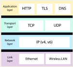

Assignment 1

1) What is a protocol stack, and how is it used in web development?

When data is transferred from one location to another on internet, it passes through various layers. These layers are called protocol stack. Refer to the following diagram for it:

 
Application Layer: This layer deals with the protocol used for transmitting the data.

Transport Layer: This layer manages the orderly delivery of data packets.

Network Layer: This layer is used to give addressed to various clients and servers connected to the network.

Link Layer: This layer deals with physical transmission of data from one point to another using cables and wireless connections.

2) What are the different types of web servers, and how do they differ in terms of functionality and performance?

Web Server - a Web server serves static content to a Web browser by loading a file from a disk and serving it across the network to a user’s Web browser using HTTP protocol.

Database Server - A database server is a server which uses a database application that provides database services to other computer programs or to computers.

Email Server - Mail server is server that handles and delivers email over a network, usually over the internet. It receives email from client computers and deliver them to other mail server. It also delivers email to client computers. 

Web Proxy - Proxy servers act as a bridge between a host server and a client server. A proxy sends data from a website to your computer IP address after it passes through the proxy's server. This practice adds a layer of security since the information is requested then transferred from the source to the proxy server and never directly from a client to another user. A proxy server can filter out various harmful internet entities.

DNS Server - These servers transform readable computer domain names into computer language IP addresses. The DNS server takes search data from a user and finds the requested address to deliver to the client device.

FTP Server - FTP servers are used to relocate files from one computer to another. Uploaded files move from your computer to the server while downloaded files are extracted from the server onto your device. 

File Server - A file server stores data files for multiple users. They allow for faster data retrieval and saving or writing files to a computer. This is a basic type of server used commonly by organizations where lots of users need access to files that are more conveniently and safely stored on a server than a personal computer.

DHCP Server -  A network server that automatically provides and assigns IP addresses, default gateways and other network parameters to client devices.

Cloud Server - A cloud server is internet infrastructure that provides computing resources to users remotely. Cloud servers can be configured to provide levels of performance, security and control similar to those of a dedicated server. But instead of being hosted on physical hardware that's solely used by you, they reside in a shared “virtualized” environment that's managed by your cloud hosting provider.

Application Server - A computer system that hosts applications and provides services to other devices on a network is known as an application server.

Printer Server - In computer networking, a print server, or printer server, is a type of server that connects printers to client computers over a network.

NTP Server - Each workstation, router, or server must be equipped with NTP client software to synchronize its clock to the network time server.

Radius Server - A RADIUS server is a central server that provides authentication and authorization services for remote users who access a network. It receives authentication requests from RADIUS clients, such as routers, firewalls, or VPNs, verifies the credentials of the user, and returns an authorization decision to the client.

Syslog Server - A Syslog server allows us to send the log information of all our network devices to one centralized place.

Physical Server - A physical server refers to a piece of hardware. It's a recognizable machine with motherboard, CPU, memory, and the like. 

3) What is web hosting, and what are the different types of hosting services available for websites?

Hosting refers to the service of storing and making websites accessible on the internet. 

Types of hosting:

1)	Shared Hosting: website will be stored on the same server as multiple other websites. With a shared hosting plan, all domains share the same server resources, such as RAM (Random Access Memory) and CPU (Central Processing Unit). 
2)	VPS Hosting: each website is hosted within its own space on the server, though it still shares a physical server with other users.
3)	Dedicated Hosting: the server is exclusively rented by you and your website is the only one stored on it. 
4)	Cloud Hosting: many computers working together, running applications using combined computing resources. It’s a hosting solution that works via a network.
5)	Managed WordPress Hosting: With managed hosting, the provider looks after the day-to-day management of the hardware, operating systems and standardised applications.
6)	Reseller Hosting: You purchase hosting resources in bulk from a provider and sell smaller hosting plans to others.

4) What is scaling, and why is it important for web applications? How does scaling differ for vertical and horizontal scaling?

Scaling is required when the number of users using the website increases and the website is not able to handle the traffic.

Vertical Scaling: When the computational power of the server is increased by increasing its storage, RAM, CPU etc.
Horizontal Scaling: When the number of servers serving the traffic is increased.

5) What is SEO (Search Engine Optimization), and how can web developers optimize their websites for better search engine rankings?

SEO means the process of improving your website to increase its visibility in Google, Microsoft Bing, and other search engines whenever people search. In order to improve ranking on search engines, developers can use the following:

Keyword Research: Use keyword research tools to find relevant and popular keywords related to the blog's content.

Optimize Content: Incorporate the selected keywords naturally into the blog posts' titles, headings, and content. Ensure the blog's content is informative, engaging, and valuable to readers.

Meta tags and Descriptions: Create compelling meta tags and descriptions for each blog post, as these elements appear in search engine results and can influence click-through rates.

Submit Sitemaps: Submit the blog's sitemap to Google and Bing Webmaster Tools to ensure search engines can crawl and index the pages efficiently

Measure and Analyze: Use Google Webmaster Tools and Bing Webmaster Tools to monitor the blog's performance, track search queries, and identify any issues that need attention
